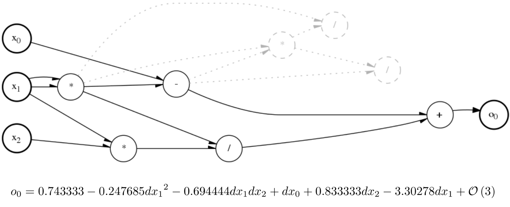

Differentiable Cartesian Genetic Programming
============================================

Differentiable Cartesian Genetic Programming (dCGP) is a recent development in the field of Genetic Programming
that adds the information about the derivatives of the output nodes (the programs, or expressions encoded) with
respect to the input nodes (the input values) and/or weights. In doing so, it enables a number of new applications
currently the subject of active research.

The evolution of the genetic program can now be supported by using the information on the derivatives, hence enabling
for the equivalent of back-propagation in Neural Networks. The fitness function can be defined in terms of the
derivatives, allowing to go beyond simple regression tasks and, additionally, solve differential equations, learn
differential models, capture conserved quantities in dynamical systems.

Beyond the standard **CGP** we provide two new encodings called **weighted** and **CGPANN**. 
The first one adds weights to the standard CGP nodes connections, while the second one allows to encode and evolve a Deep Neural Network using the CGP basic idea.

   A dCGP expression and its differential expansion in a specified point

----------------------------------------------------------------

Table of contents:
^^^^^^^^^^^^^^^^^^^^

.. toctree::
  :maxdepth: 1

  installation
  quickstart
  docs/index
  tutorials/index
  theory

---------------------------------------------------------------

References
^^^^^^^^^^

.. [dCGP1] Dario, Francesco Biscani, and Alessio Mereta. "Differentiable genetic programming." In European Conference on Genetic Programming, pp. 35-51. Springer, 2017. `Arxiv version (2016) <https://arxiv.org/pdf/1611.04766v1.pdf>`_ 

.. [dCGP2] Märtens, M., & Izzo, D. Neural network architecture search with differentiable cartesian genetic programming for regression. In Proceedings of the Genetic and Evolutionary Computation Conference Companion (pp. 181-182). ACM. `Arxiv version (2018) <https://arxiv.org/abs/1907.01939>`_ 
