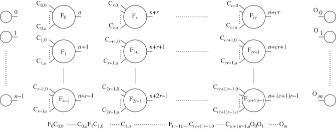

Cartesian Genetic Programming (CGP)
====================================

Cartesian Genetic Programming (CGP) is a form of Genetic Programming where a computer program
is represented by an acyclic graph and is evolved using a standard evolutionary strategy.

For more information visit `Cartesian Genetic Programming <http://www.cartesiangp.co.uk/>`_.
